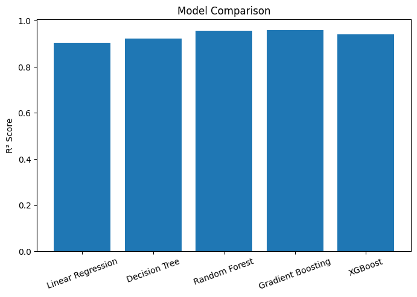
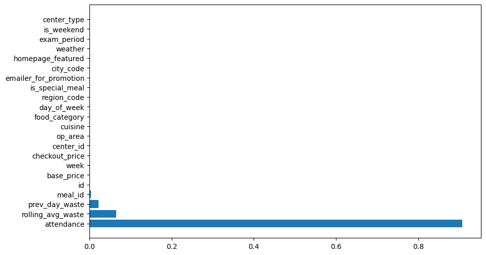
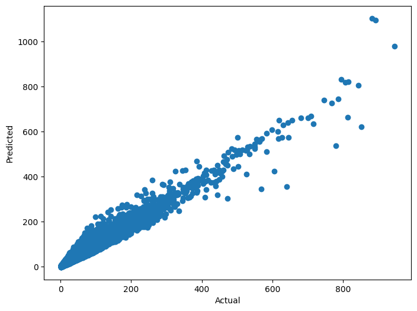

# Hostel Mess Food Wastage Prediction Using Machine Learning

## Overview

This project predicts hostel mess food wastage using Machine Learning techniques. The system analyzes attendance patterns, menu characteristics, exam periods, and historical food waste data to optimize food preparation and reduce wastage.

---

## Problem Statement

Hostel messes frequently face challenges in estimating food demand accurately. Variations in attendance, special meals, and academic schedules often result in excess food preparation and increased wastage.

This project develops a predictive system that forecasts food wastage before meal preparation.

---

## Dataset

Food Demand Forecasting Dataset (45,000+ records)

Files Used:

- train.csv
- meal_info.csv
- fulfilment_center_info.csv

---

## Feature Engineering

Features used:

- Attendance
- Food Category
- Cuisine
- Exam Period
- Weekend Indicator
- Weather Conditions
- Previous Day Waste
- Rolling Average Waste

---

## Algorithms Implemented

- Linear Regression
- Decision Tree Regressor
- Random Forest Regressor
- Gradient Boosting Regressor
- XGBoost Regressor

---

## Performance Comparison

| Model | MAE | RMSE | R² |
|--------|--------|--------|--------|
| Linear Regression | 6.60 | 12.53 | 0.903 |
| Decision Tree | 5.55 | 11.12 | 0.923 |
| Random Forest | 4.48 | 8.31 | 0.957 |
| Gradient Boosting | 4.46 | 8.21 | 0.958 |
| XGBoost | 4.32 | 9.67 | 0.942 |

### Best Model

**Gradient Boosting Regressor**

R² Score = **0.958**

---

## Results

### Model Comparison

### Feature Importance

### Actual vs Predicted

---

## Technologies Used

- Python
- Pandas
- NumPy
- Scikit-Learn
- XGBoost
- Matplotlib

---

## Future Scope

- QR-based Attendance System
- IoT Weight Sensors
- Real-time Dashboard
- Computer Vision Based Waste Detection

---

## Author

**Vansh Juneja**
